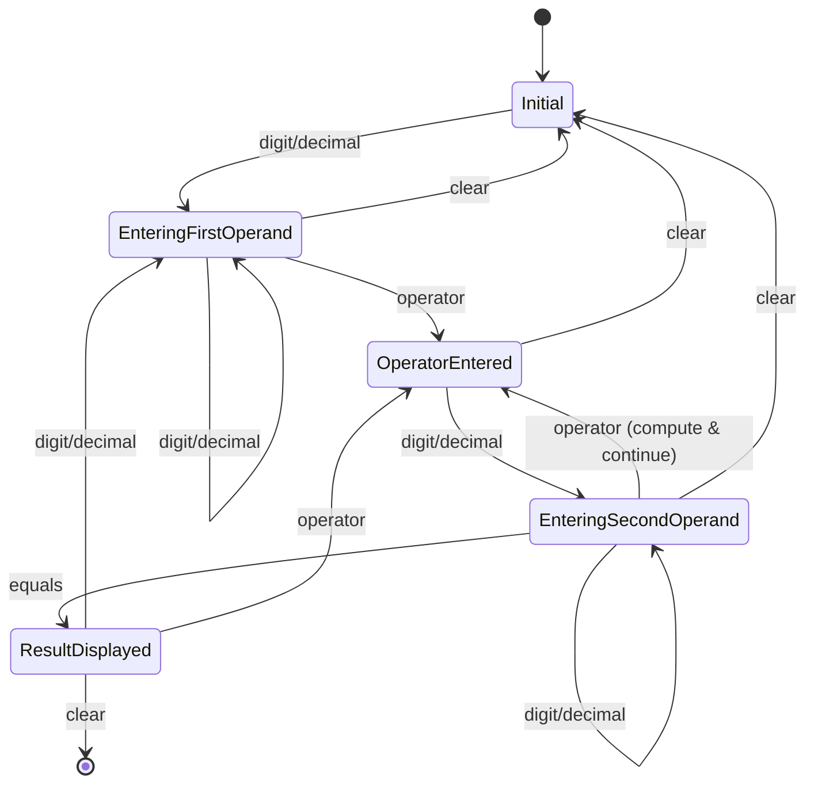

# Документ дизайна: Личный калькулятор

## Обзор

Личный калькулятор — это настольное приложение, предоставляющее пользователям интуитивный интерфейс для выполнения базовых арифметических операций. Дизайн вдохновлен Windows Calculator и фокусируется на простоте использования, надежности вычислений и знакомом пользовательском опыте.

### Ключевые особенности дизайна

- **Архитектура Model-View-Controller (MVC)**: Четкое разделение логики вычислений, состояния приложения и представления пользовательского интерфейса
- **Конечный автомат для управления состоянием**: Калькулятор моделируется как конечный автомат с явными переходами между состояниями
- **Двойная система ввода**: Поддержка как мышиного, так и клавиатурного ввода с единой точкой обработки команд
- **Высокоточные вычисления**: Использование типов данных с плавающей точкой двойной точности для минимизации ошибок округления

## Архитектура

### Общая структура

Приложение следует паттерну MVC с дополнительным слоем для управления состоянием:

```
┌─────────────────────────────────────────────────────────┐
│                    View Layer (UI)                      │
│  ┌──────────────┐  ┌──────────────┐  ┌──────────────┐  │
│  │   Display    │  │    Buttons   │  │   History    │  │
│  │  Component   │  │     Grid     │  │    Panel     │  │
│  └──────────────┘  └──────────────┘  └──────────────┘  │
└────────────┬────────────────────────────────────────────┘
             │ Events (button clicks, key presses)
             ▼
┌─────────────────────────────────────────────────────────┐
│                  Controller Layer                       │
│  ┌──────────────────────────────────────────────────┐  │
│  │           Input Handler                          │  │
│  │  (maps UI events to calculator commands)        │  │
│  └──────────────────────────────────────────────────┘  │
└────────────┬────────────────────────────────────────────┘
             │ Commands
             ▼
┌─────────────────────────────────────────────────────────┐
│                    Model Layer                          │
│  ┌──────────────┐  ┌──────────────┐  ┌──────────────┐  │
│  │ Calculator   │  │    State     │  │   History    │  │
│  │   Engine     │  │   Machine    │  │   Manager    │  │
│  └──────────────┘  └──────────────┘  └──────────────┘  │
└─────────────────────────────────────────────────────────┘
```

### Конечный автомат калькулятора

Калькулятор работает в одном из следующих состояний:



### Состояния калькулятора

1. **Initial**: Начальное состояние, дисплей показывает "0"
2. **EnteringFirstOperand**: Пользователь вводит первый операнд
3. **OperatorEntered**: Оператор выбран, ожидается второй операнд
4. **EnteringSecondOperand**: Пользователь вводит второй операнд
5. **ResultDisplayed**: Результат вычисления отображен на дисплее
6. **Error**: Состояние ошибки (например, деление на ноль)

## Компоненты и интерфейсы

### 1. Calculator Engine (Движок вычислений)

Ответственность: Выполнение арифметических операций с высокой точностью.

```typescript
interface CalculatorEngine {
  // Базовые арифметические операции
  add(a: number, b: number): number;
  subtract(a: number, b: number): number;
  multiply(a: number, b: number): number;
  divide(a: number, b: number): Result<number, DivisionError>;
  
  // Унарные операции
  negate(value: number): number;
  percent(base: number, value: number, operator: Operator): number;
  
  // Утилиты форматирования
  formatResult(value: number, maxDigits: number): string;
  parseNumber(input: string): number;
}
```

### 2. State Machine (Машина состояний)

Ответственность: Управление состоянием калькулятора и переходами между состояниями.

```typescript
interface StateMachine {
  // Текущее состояние
  getCurrentState(): CalculatorState;
  
  // Обработка команд
  handleDigit(digit: string): void;
  handleDecimal(): void;
  handleOperator(operator: Operator): void;
  handleEquals(): void;
  handleClear(): void;
  handleClearEntry(): void;
  handleBackspace(): void;
  handleNegate(): void;
  handlePercent(): void;
  
  // Получение текущих значений
  getDisplayValue(): string;
  getCurrentExpression(): Expression | null;
}
```

### 3. History Manager (Менеджер истории)

Ответственность: Хранение и управление историей вычислений.

```typescript
interface HistoryManager {
  // Добавление записи
  addEntry(expression: string, result: number): void;
  
  // Получение истории
  getHistory(): HistoryEntry[];
  getLastEntries(count: number): HistoryEntry[];
  
  // Очистка истории
  clear(): void;
  
  // Загрузка результата из истории
  loadResult(entryId: string): number;
}

interface HistoryEntry {
  id: string;
  expression: string;
  result: number;
  timestamp: Date;
}
```

### 4. Input Handler (Обработчик ввода)

Ответственность: Преобразование событий UI (клики мышью, нажатия клавиш) в команды калькулятора.

```typescript
interface InputHandler {
  // Обработка событий кнопок
  handleButtonClick(buttonId: string): void;
  
  // Обработка клавиатурного ввода
  handleKeyPress(key: string): void;
  
  // Маппинг клавиш на команды
  mapKeyToCommand(key: string): Command | null;
}
```

### 5. Display Component (Компонент дисплея)

Ответственность: Отображение текущего значения, выражения и сообщений об ошибках.

```typescript
interface DisplayComponent {
  // Обновление дисплея
  updateValue(value: string): void;
  updateExpression(expression: string): void;
  
  // Отображение ошибок
  showError(message: string): void;
  clearError(): void;
  
  // Форматирование отображения
  formatForDisplay(value: number): string;
}
```

### 6. Button Grid Component (Компонент сетки кнопок)

Ответственность: Отображение и обработка кликов на кнопки калькулятора.

```typescript
interface ButtonGridComponent {
  // Рендеринг кнопок
  render(): void;
  
  // Обработка кликов
  onButtonClick(buttonId: string, handler: (id: string) => void): void;
  
  // Визуальная обратная связь
  highlightButton(buttonId: string): void;
  resetHighlight(): void;
}
```

### 7. History Panel Component (Компонент панели истории)

Ответственность: Отображение истории вычислений и обработка взаимодействия с записями.

```typescript
interface HistoryPanelComponent {
  // Обновление отображения истории
  updateHistory(entries: HistoryEntry[]): void;
  
  // Обработка кликов на записи
  onEntryClick(entryId: string, handler: (id: string) => void): void;
  
  // Очистка истории
  onClearHistory(handler: () => void): void;
}
```

## Модели данных

### CalculatorState

Представляет текущее состояние калькулятора.

```typescript
type StateType = 
  | 'Initial'
  | 'EnteringFirstOperand'
  | 'OperatorEntered'
  | 'EnteringSecondOperand'
  | 'ResultDisplayed'
  | 'Error';

interface CalculatorState {
  type: StateType;
  displayValue: string;
  firstOperand: number | null;
  operator: Operator | null;
  secondOperand: number | null;
  currentInput: string;
  hasDecimalPoint: boolean;
  clearOnNextDigit: boolean;
  lastClearTime: number | null; // для обнаружения двойного нажатия C
}
```

### Operator

Представляет математический оператор.

```typescript
type Operator = 'add' | 'subtract' | 'multiply' | 'divide';

interface OperatorInfo {
  symbol: string;      // '+', '-', '×', '÷'
  precedence: number;  // для будущего расширения
  compute: (a: number, b: number) => Result<number, Error>;
}
```

### Expression

Представляет математическое выражение.

```typescript
interface Expression {
  firstOperand: number;
  operator: Operator;
  secondOperand: number;
  
  // Методы
  evaluate(): Result<number, Error>;
  toString(): string;
}
```

### Result Type

Тип для обработки успешных результатов и ошибок.

```typescript
type Result<T, E> = 
  | { success: true; value: T }
  | { success: false; error: E };

type DivisionError = {
  type: 'DivisionByZero';
  message: string;
};
```

### Command

Представляет команду калькулятора.

```typescript
type Command =
  | { type: 'Digit'; value: string }
  | { type: 'Decimal' }
  | { type: 'Operator'; operator: Operator }
  | { type: 'Equals' }
  | { type: 'Clear' }
  | { type: 'ClearEntry' }
  | { type: 'Backspace' }
  | { type: 'Negate' }
  | { type: 'Percent' };
```

### Configuration

Константы конфигурации приложения.

```typescript
interface CalculatorConfig {
  maxDigits: number;              // 16
  maxDecimalPlaces: number;       // 10
  historyMaxEntries: number;      // 20
  doubleClearTimeout: number;     // 500ms
  exponentialThreshold: number;   // 1e16
}
```


## Свойства корректности

*Свойство — это характеристика или поведение, которое должно оставаться истинным во всех корректных выполнениях системы — по сути, формальное утверждение о том, что система должна делать. Свойства служат мостом между человекочитаемыми спецификациями и машинопроверяемыми гарантиями корректности.*

### Свойство 1: Корректность сложения

*Для любых* двух чисел a и b, когда пользователь вводит их с оператором сложения и нажимает "=", отображаемый результат должен быть равен математической сумме a + b (с учетом точности до 10 знаков после запятой).

**Validates: Requirements 1.1**

### Свойство 2: Корректность вычитания

*Для любых* двух чисел a и b, когда пользователь вводит их с оператором вычитания и нажимает "=", отображаемый результат должен быть равен математической разности a - b (с учетом точности до 10 знаков после запятой).

**Validates: Requirements 1.2**

### Свойство 3: Корректность умножения

*Для любых* двух чисел a и b, когда пользователь вводит их с оператором умножения и нажимает "=", отображаемый результат должен быть равен математическому произведению a × b (с учетом точности до 10 знаков после запятой).

**Validates: Requirements 1.3**

### Свойство 4: Корректность деления

*Для любых* двух чисел a и b, где b ≠ 0, когда пользователь вводит их с оператором деления и нажимает "=", отображаемый результат должен быть равен математическому частному a ÷ b (с учетом точности до 10 знаков после запятой).

**Validates: Requirements 1.4**

### Свойство 5: Обработка деления на ноль

*Для любого* числа a, когда пользователь пытается разделить a на 0, калькулятор должен отобразить сообщение "Деление на ноль невозможно" И очистить текущее выражение, переведя калькулятор в начальное состояние.

**Validates: Requirements 2.1, 2.2**

### Свойство 6: Добавление цифр к операнду

*Для любой* последовательности цифр (0-9), когда пользователь последовательно нажимает соответствующие кнопки, дисплей должен отображать строку, составленную из этих цифр в порядке нажатия.

**Validates: Requirements 3.1**

### Свойство 7: Добавление десятичной точки

*Для любого* целого числа на дисплее, когда пользователь нажимает кнопку десятичной точки, дисплей должен отображать это число с добавленной десятичной точкой в конце.

**Validates: Requirements 3.2**

### Свойство 8: Игнорирование повторной десятичной точки

*Для любого* числа, уже содержащего десятичную точку, повторное нажатие кнопки десятичной точки не должно изменять отображаемое значение.

**Validates: Requirements 3.3**

### Свойство 9: Очистка текущего операнда (Clear)

*Для любого* состояния калькулятора, когда пользователь нажимает кнопку "C" один раз, дисплей должен отображать "0", а текущий операнд должен быть очищен.

**Validates: Requirements 4.1**

### Свойство 10: Очистка только текущего ввода (Clear Entry)

*Для любого* состояния калькулятора, где уже введены первый операнд и оператор, когда пользователь нажимает кнопку "CE", должен очиститься только текущий операнд, а первый операнд и оператор должны сохраниться.

**Validates: Requirements 4.2**

### Свойство 11: Полный сброс при двойном Clear

*Для любого* состояния калькулятора, когда пользователь нажимает кнопку "C" дважды подряд (в течение 500ms), все состояние калькулятора должно быть полностью сброшено: первый операнд, оператор, второй операнд и история текущего выражения.

**Validates: Requirements 4.3**

### Свойство 12: Вычисление промежуточных результатов в цепочках операций

*Для любой* последовательности операций вида "a op1 b op2", где op1 и op2 — операторы, когда пользователь вводит второй оператор op2, калькулятор должен сначала вычислить результат (a op1 b) и отобразить его на дисплее, затем использовать этот результат как первый операнд для следующей операции с op2.

**Validates: Requirements 5.1, 5.2**

### Свойство 13: Точность промежуточных вычислений

*Для любой* последовательности операций, все промежуточные результаты должны сохранять точность до 10 знаков после запятой.

**Validates: Requirements 5.3**

### Свойство 14: Вычисление и отображение финального результата

*Для любого* корректного выражения, когда пользователь нажимает кнопку "=", калькулятор должен вычислить результат и отобразить его на дисплее, округлив до 10 знаков после запятой.

**Validates: Requirements 6.1, 6.2**

### Свойство 15: Инверсия знака (идемпотентность двойного применения)

*Для любого* ненулевого числа n на дисплее, двойное применение операции смены знака (+/-) должно вернуть исходное значение: -(-n) = n.

**Validates: Requirements 7.1**

### Свойство 16: Вычисление процента для сложения и вычитания

*Для любых* двух чисел a и b, когда пользователь вводит "a + b %" или "a - b %", калькулятор должен вычислить b как процент от a, то есть результат должен быть равен a × (b / 100).

**Validates: Requirements 8.1**

### Свойство 17: Вычисление процента для умножения и деления

*Для любых* двух чисел a и b, когда пользователь вводит "a × b %" или "a ÷ b %", калькулятор должен преобразовать b в десятичную дробь, разделив на 100.

**Validates: Requirements 8.2**

### Свойство 18: Удаление последней цифры

*Для любого* многозначного числа на дисплее, когда пользователь нажимает кнопку "⌫" (Backspace), дисплей должен отображать то же число без последней цифры.

**Validates: Requirements 9.1**

### Свойство 19: Эквивалентность клавиатурного и мышиного ввода

*Для любой* команды калькулятора, доступной через кнопку UI, соответствующее нажатие клавиши на клавиатуре должно производить идентичный эффект на состояние калькулятора и дисплей.

**Validates: Requirements 11.1, 11.2**

### Свойство 20: Добавление вычислений в историю

*Для любого* корректного выражения, когда пользователь завершает вычисление нажатием "=", выражение и его результат должны быть добавлены в историю как новая запись.

**Validates: Requirements 12.1**

### Свойство 21: Ограничение размера истории

*Для любой* последовательности из N вычислений, где N > 20, история должна содержать только последние 20 записей, отбрасывая самые старые.

**Validates: Requirements 12.2**

### Свойство 22: Загрузка результата из истории

*Для любой* записи в истории, когда пользователь кликает на эту запись, результат из записи должен быть загружен на дисплей как текущий операнд.

**Validates: Requirements 12.3**

### Свойство 23: Очистка истории

*Для любого* состояния истории, когда пользователь выполняет команду очистки истории, все записи должны быть удалены, и история должна стать пустой.

**Validates: Requirements 12.4**

## Обработка ошибок

### Стратегия обработки ошибок

Калькулятор использует явную обработку ошибок через тип Result<T, E>, что позволяет безопасно обрабатывать исключительные ситуации без использования исключений.

### Типы ошибок

1. **DivisionByZeroError**: Возникает при попытке деления на ноль
   - Сообщение: "Деление на ноль невозможно"
   - Действие: Отображение сообщения, очистка текущего выражения, переход в состояние Error

2. **InvalidInputError**: Возникает при некорректном вводе
   - Примеры: попытка ввода 17-й цифры, некорректный формат числа
   - Действие: Игнорирование ввода, сохранение текущего состояния

3. **OverflowError**: Возникает при результате, превышающем максимальное представимое число
   - Действие: Отображение результата в экспоненциальной нотации

4. **UnderflowError**: Возникает при результате, меньшем минимального представимого числа
   - Действие: Отображение 0 или результата в экспоненциальной нотации

### Восстановление после ошибок

После возникновения ошибки:
- Пользователь может нажать "C" для возврата в начальное состояние
- Пользователь может начать новый ввод, что автоматически очистит ошибку
- Состояние калькулятора остается консистентным

### Валидация ввода

Все пользовательские вводы валидируются перед обработкой:
- Проверка длины числа (максимум 16 цифр)
- Проверка наличия десятичной точки перед добавлением новой
- Проверка корректности последовательности операций

## Стратегия тестирования

### Двойной подход к тестированию

Для обеспечения корректности калькулятора используется комбинация двух типов тестирования:

1. **Unit-тесты**: Проверяют конкретные примеры, граничные случаи и условия ошибок
2. **Property-based тесты**: Проверяют универсальные свойства на множестве сгенерированных входных данных

Оба типа тестов дополняют друг друга: unit-тесты выявляют конкретные баги, а property-based тесты проверяют общую корректность.

### Property-Based Testing

**Библиотека**: Выбор зависит от языка реализации:
- JavaScript/TypeScript: `fast-check`
- Python: `hypothesis`
- Java: `jqwik`
- C#: `FsCheck`

**Конфигурация**:
- Минимум 100 итераций на каждый property-тест
- Каждый тест должен быть помечен комментарием, ссылающимся на свойство из документа дизайна
- Формат тега: `Feature: personal-calculator, Property {number}: {краткое описание свойства}`

**Генераторы данных**:
- Генератор случайных чисел в диапазоне [-1e15, 1e15]
- Генератор десятичных чисел с различным количеством знаков после запятой
- Генератор последовательностей операций
- Генератор состояний калькулятора

### Unit Testing

**Фокус unit-тестов**:
- Конкретные примеры: "2 + 2 = 4", "10 - 5 = 5"
- Граничные случаи:
  - Ввод ровно 16 цифр (максимум)
  - Попытка ввода 17-й цифры (должна игнорироваться)
  - Результат с более чем 16 цифрами (экспоненциальная нотация)
  - Смена знака нуля (должен остаться "0")
  - Backspace на однозначном числе (должен показать "0")
- Условия ошибок:
  - Деление на ноль
  - Переполнение
  - Недостаточное заполнение (underflow)
- Интеграционные точки:
  - Взаимодействие между State Machine и Calculator Engine
  - Синхронизация Display с состоянием
  - Обработка событий Input Handler

**Баланс тестирования**:
- Избегайте написания слишком большого количества unit-тестов для проверки множества входных данных
- Property-based тесты лучше справляются с покрытием большого пространства входных данных
- Unit-тесты должны фокусироваться на специфических сценариях, которые важны для понимания поведения системы

### Тестовое покрытие

**Обязательное покрытие**:
- Все 23 свойства корректности должны быть реализованы как property-based тесты
- Все граничные случаи из критериев приемки должны иметь unit-тесты
- Все примеры из критериев приемки должны иметь unit-тесты

**Целевые метрики**:
- Покрытие кода: минимум 90%
- Покрытие ветвлений: минимум 85%
- Все публичные методы компонентов должны быть протестированы

### Тестирование UI

**Подход**:
- Отделение логики от представления позволяет тестировать Calculator Engine и State Machine независимо от UI
- UI компоненты тестируются через интеграционные тесты
- Используются моки для Input Handler при тестировании State Machine

**Инструменты** (зависят от выбранного фреймворка):
- Для веб-приложения: Jest + React Testing Library / Vitest + Testing Library
- Для десктопного приложения: фреймворк-специфичные инструменты (например, Electron + Spectron)

### Примеры тегов для property-based тестов

```typescript
// Feature: personal-calculator, Property 1: Корректность сложения
test('addition correctness property', () => {
  fc.assert(
    fc.property(fc.float(), fc.float(), (a, b) => {
      const result = calculator.compute(a, '+', b);
      expect(result).toBeCloseTo(a + b, 10);
    }),
    { numRuns: 100 }
  );
});

// Feature: personal-calculator, Property 15: Инверсия знака
test('negate idempotence property', () => {
  fc.assert(
    fc.property(fc.float().filter(n => n !== 0), (n) => {
      const negated = calculator.negate(n);
      const doubleNegated = calculator.negate(negated);
      expect(doubleNegated).toBeCloseTo(n, 10);
    }),
    { numRuns: 100 }
  );
});
```

### Непрерывное тестирование

- Все тесты должны выполняться при каждом коммите
- Property-based тесты должны использовать фиксированный seed для воспроизводимости
- При обнаружении failing case в property-based тесте, он должен быть добавлен как отдельный unit-тест

